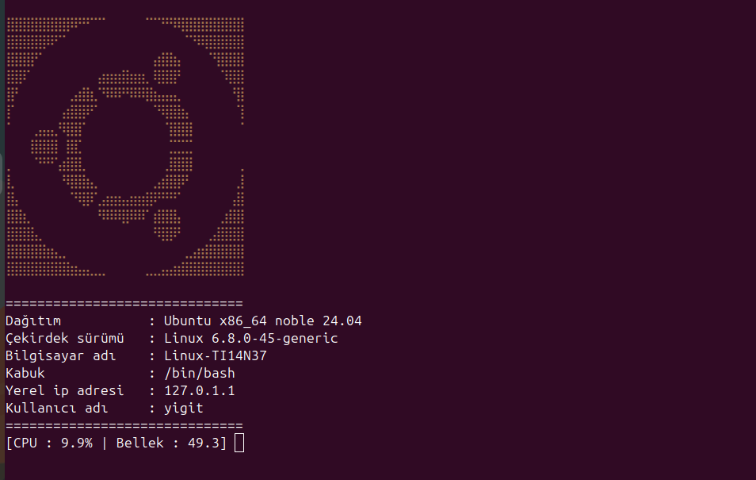

# LinuxInfo
This Program runs on GNU/Linux distributions It is a program that outputs information about the GNU Linux distribution. It's like Neofetch but different.

### Required packages for install and ful install:

  <button style="position:absolute; top:5px; right:5px; background-color:#fff; border:none; color:#000; padding:5px 10px; border-radius:3px;" onclick="navigator.clipboard.writeText('python3 python3-venv python3-pip g++ gcc')"></button>
  <pre><code>python3 python3-venv python3-pip g++ gcc</code></pre>

### Ful install:

  <button style="position:absolute; top:5px; right:5px; background-color:#fff; border:none; color:#000; padding:5px 10px; border-radius:3px;" onclick="navigator.clipboard.writeText('git clone https://github.com/YigitC7/LinuxBilgi && cd LinuxBilgi && sudo sh install.sh')"></button>
  <pre><code>git clone https://github.com/YigitC7/LinuxBilgi && cd LinuxBilgi && sudo sh install.sh</code></pre>

# Installation:
Start the install.sh file to install the program or run the full install command. If you have a problem with the installation, copy the commands in the install.sh file into the terminal.
# 

